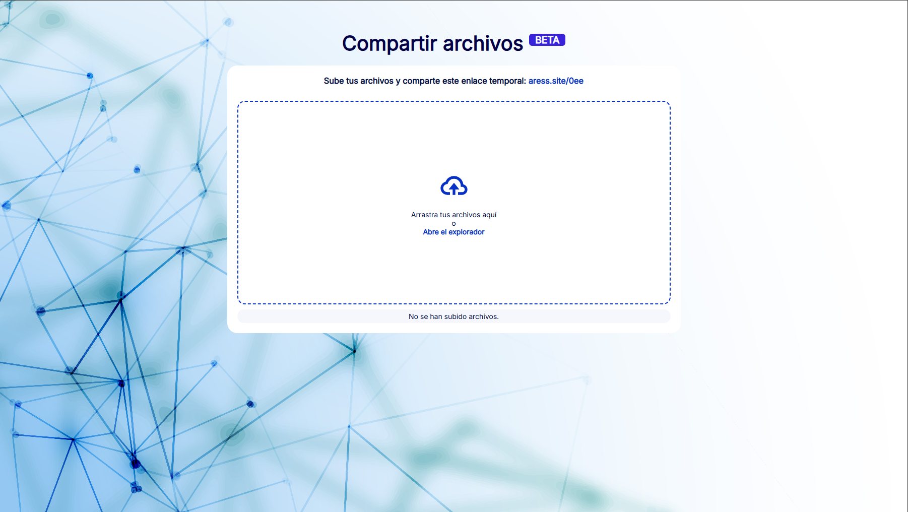

# Files Upload - Compartir Archivos

La forma más rápida de compartir un archivo. Desde donde quieras hacia donde quieras.

## 🚨 Problemas detectados y soluciones

### 1. ❌ Subida de archivos con extensiones peligrosas

*Problema:*  
Se detectó que el sistema de carga permitía archivos con extensiones potencialmente peligrosas como .php, .iso, .rar, .py, .html, entre otros.

*✅ Solución implementada:*  
Se agregó una verificación en el código PHP para bloquear de forma anticipada cualquier archivo con estas extensiones antes de ser movido a la carpeta de destino.

### 2. 🛑 Subida de archivos con doble extensión

*Problema:*  
Los archivos con doble extensión (por ejemplo, malware.php.jpg) pueden representar un riesgo de seguridad o confundir a los usuarios.

*✅ Solución implementada:*  
Se implementó una validación que analiza el nombre del archivo. Si contiene más de una extensión y alguna intermedia es peligrosa, se bloquea automáticamente.

### 3. 🖼️ Mala verificación de imágenes

*Problema:*  
Antes no se realizaba una verificación adecuada del contenido real de las imágenes subidas, lo que permitía archivos no válidos con extensión .jpg o similares.

*✅ Solución implementada:*  
Ahora se usa getimagesize() para comprobar que el archivo tenga dimensiones válidas, tipo de imagen correcto y se asegure que su tipo MIME sea del tipo image/*.

### 4. ❗ Mensajes de error no mostrados al usuario

*Problema:*  
Aunque el backend generaba mensajes de error o advertencia, estos no se mostraban correctamente en la interfaz gráfica del usuario.

*✅ Solución implementada:*  
Se mejoró la integración entre PHP y la interfaz HTML para mostrar mensajes claros y en español. Además:
- Se resaltan con color rojo o verde según el tipo de mensaje.
- Se ocultan por defecto y solo aparecen cuando hay interacción.
- Se añade soporte para múltiples mensajes combinados en una sola subida.

### 5. 🧩 Otros cambios

- Se mejoró el orden visual del sistema.
- Se añadió una barra de carga animada que aparece durante la subida de archivos.
- Se aplicó un fondo visual más moderno y profesional.
- Se agregaron íconos representativos a los archivos subidos según su tipo: PDF, imágenes, Word, comprimidos, etc.

## Screenshots

